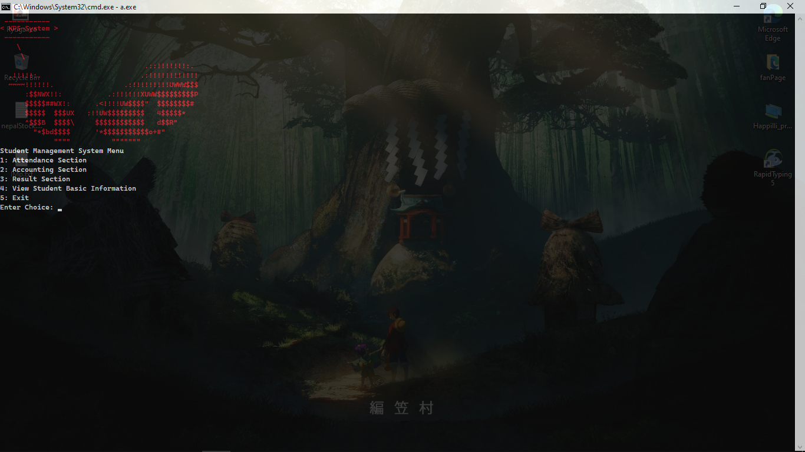

# KPS-System


This repository contains a simple Student Management System written in C. The program allows users to add, view, update, and delete student records. It demonstrates basic file handling operations for data storage.

## Dependencies

The Student Management System does not have any external dependencies. It is implemented using standard C libraries and functions.

## How to Run

To run the KPS-System on your local machine, follow these steps:

1. Clone the repository to your local machine using Git:
   ```bash
   git clone https://github.com/RyuZinOh/KPS-System.git
   ```

2. Navigate to the project directory:
   ```bash
   cd KPS-System
   cd main_program
   ```

3. Compile the C program using a C compiler (e.g., gcc):
   ```bash
   gcc KPS.c
   ```

4. Run the executable:
   ```bash
   ./KPS.exe
   ```

## Usage

- Upon running the program, you will be presented with a menu of options:
  ```
  Student Management System Menu
  1. Attandance Section
  2. Accouting Section
  3. Result Section
  4. View Student Basic Information
  5. Exit
  ```
- Use the corresponding option number to perform the desired operation.
- The student data will be stored in the corresponding `.txt` file in the project directory.
## Screenshots


## Contribution

Contributions to the Student Management System project are welcome! If you find any bugs or have suggestions for improvements, please feel free to open an issue or submit a pull request.

## License

This project is licensed under the MIT License - see the [LICENSE](LICENSE) file for details.

## Status

This project is actively maintained and is open for contributions. Feel free to check out the [issues](https://github.com/RyuZinOh/KPS-System/Issues) page to see what's currently being worked on or to report any problems.


